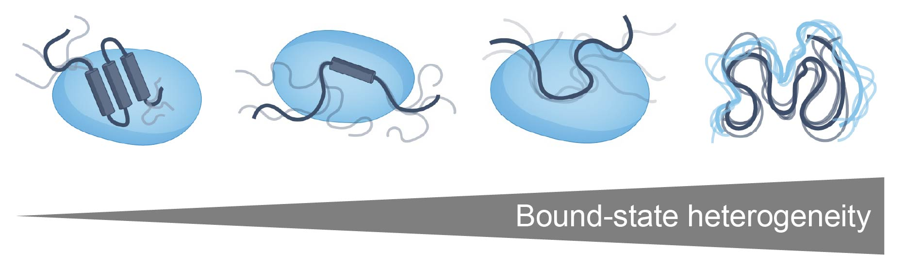

Background
==============

IDR binding
-----------------

Intrinsically disordered proteins and protein regions (IDRs) play **crucial** roles in various cellular processes [1]_ [2]_ [3]_. Unlike structured proteins, IDRs do not have a fixed three-dimensional structure, and exist as a collection of interconverting conformations. Despite lacking a single 3D structure, IDRs play a wide variety of important roles in cellular function, including transcriptional regulation, signal transduction, and cellular organization. In many cases, IDR function depends on their ability to interact with other biomolecules, especially with other proteins (folded and disordered) and nucleic acids. There is substantial interest in understanding how IDRs interact with their binding partners.

IDR-mediated molecular interactions exist on a spectrum. At one end, IDRs can fold upon binding, engaging in an inter-molecular folding event that gives rise to a defined structured interface. We refer to this type of molecular recognition as **sequence-specific** (or site-specific) molecular recognition - i.e. the precise order of the amino acids dictates specificity and affinity (left-side of figure below) [4]_. At the other end of the spectrum, IDRs can also interact in the absence of a structured interface, with attractive interactions between an IDR and a partner driven mediated through a disordered bound state whereby transient complementary chemical interactions drive affinity and specificity. This type of interaction is often referred to as "fuzzy" binding [5]_ [6]_. We refer to this type of specificity as **chemical specificity** (right-side of figure below).

Chemical specificity can enhance sequence-specific binding, but may also drive intermolecular interactions in their own right [7]_. In the context of proteins that undergo phase separation in the test tube and form biomolecular condensates in cells, chemical specificity is one part of the larger "molecular grammar" that determines the interactions that determine condensate driving forces and dynamics. However, despite its importance, chemical specificity has been hard to quantify and characterize systematically. 

Structure-based tools such as AlphaFold offer the potential to predict IDR-mediated interactions where defined structural interfaces appear. However, these structure-centric methods are poorly suited for situations in which IDRs interact transiently in many isoenergetic conformations with a partner with minimal (if any) acquisition of structure. As such, it has been challenging to determine which subregions of an IDR may be facilitating interactions with a partner. Importantly, this question is unavoidably partner-specific - the same IDR may interact with different partners in different ways, so there may not be a universal "binding region" within an IDR.

FINCHES: a tool to predict chemical specificity from sequence
----------------------------------------------------------------

FINCHES is a software package that implmeements a computational method for predicting IDR-mediated chemical specificity directly from sequence [8]_. It works by taking the parameters and equations developed originally for coarse-grained simulations of disordered proteins and repurposing that chemical physics as an approximate energy function to identify regions and residues that drive attractive and repulsive interaction. 

Specifically, coarse-grained force field define non-bonded pair potentials that describe the instantaneous potential energy as a function of inter-residue distance between pairs of amino acids. These potentials are codifying the sequence-specific attractive or repulsuve interactions between pairs of residues. For coarse-grained force fields design to accurately recapitulate the conformational behavior of disordered proteins, these work because they have a reasonable first-order approximation for the inter-residue attractive and repulsive interactions that matter for disordered proteins. 

FINCHES uses a relatively simple approach:

1. For predicting interaction between two IDRs (sequence 1 of length m, and sequence 2 of length n), we take the two sequences and for every pair of inter-molecular residues calculate the integral under the pairwise potential that is defined by the sum of the non-bonded terms. This integral is an "interaction score" - note this is not a second virial coefficient (because we are taking the area under the curve, not integral of exp(-u/kT)) - but is highly correlated with the second virial coefficient (see Fig. S19 in the FINCHES paper). Doing this for two sequences that are *n* and *m* amino acids gives us an n x m matrix of interaction scores.

2. We then consider local sequence chemistry to modulate the n x m matrix of interaction scores. Specifically, this has two empirical corrections: one to correct local charge effects, whereby clusters of oppositely charged residues become less repulsive for one another than they might otherwise be, and one to account for local hydrophobic interfaces, whereby contiguous runs of aliphatic hydrophobes are more attractive for aliphatics than individual aliphatics. These corrections give us a "weighted" matrix.

3. To calculate the mean-field interaction parameter, we take the weighted matrix, subtract a baseline such that 0 means non-interacting, less than zero means attractive, and greater than 0 means repulsive. We then divide this baseline corrected matrix out into an attractive and a repulsive matrix and calculate the mean of the rows in the matrix, so if we had an m x n matrix, we generate two vectors of length m, with each element representing the mean along the rows of the attractive and repulsive matrices. To calculate epsilon we then take these two vectors and sum them together. This results in an extensive value that depends on the length of sequence one (i.e., m) but not on the length of sequence two. This means that the order in which sequences are passed matters for the epsilon value.

4. To calculate the intermap, we generate the weighted matrix described in step 3. We then take that weighted matrix and using a defined windowsize, extract out all possible submatrices made up of pairs of subsequences from sequence 1 and 2. For each sub-matrix we calculate the epsilon value (as described in step 4), building up a 2D map.

5. To calculate phase diagrams, we use the overall mean-field epsilon value calculated in step 4, and then use the Flory-Huggins theory to calculate the phase diagram. We convert the extensive epsilon value into an intensive flory-chi parameter by dividing by sequence 1 length.

Core assumptions
------------------

There are several core assumption FINCHES makes:

1. **No long-range correlation in interactions**. While FINCHES-based predictions are sensitive to the order of amino acids, those effects are extremely local. As a result, there are no long-range correlations built into the interaction predictions.

2. **No structre in the bound state**. We also assume we can average over all possible 3D configurations of the IDR of interest with no consideration of either structure or even excluded volume. If there are strong conformational biases in either the bound or unbound state we might expect these to impact the accuracy of predictions. 

3. **Only chemical specificity**: If the residues in an IDR engage in structured interactions, these will be entirely missed; FINCHES is excusievly describing chemical specificity. In reality many IDRs interact with a combination of sequence- and chemica-specificity, such that considering only chemical specific  likely offers an incomplete description of binding in many situations. 

Overall, it's important to recall that the epsilon value is NOT a free energy of binding, but rather a mean-field interaction energy that is a measure of the average interaction strength between two sequences. This is a useful first-order approximation in situations in which an IDR is relatively chemically homogenous. However, it  should not be interpreted as a free energy of binding. Moreover, for IDRs with distinct chemical subregions, a single mean-field value is likely not particularly useful. Similarly, for intermaps, these should be read as "which regions of my chain would likely be attractive or repulsive for the partner of interest", as opposed to using it to predict either bound-state structure or even binding affinities.  

References
-----------------

.. [1] Holehouse, A. S. & Kragelund, B. B. The molecular basis for cellular function of intrinsically disordered protein regions. Nat. Rev. Mol. Cell Biol. 25, 187-211 (2024).
  
.. [2] van der Lee, R., Buljan, M., Lang, B., Weatheritt, R. J., Daughdrill, G. W., Dunker, A. K., Fuxreiter, M., Gough, J., Gsponer, J., Jones, D. T., Kim, P. M., Kriwacki, R. W., Oldfield, C. J., Pappu, R. V., Tompa, P., Uversky, V. N., Wright, P. E. & Babu, M. M. Classification of intrinsically disordered regions and proteins. Chem. Rev. 114, 6589-6631 (2014).
  
.. [3] Wright, P. E. & Dyson, H. J. Intrinsically unstructured proteins: re-assessing the protein structure-function paradigm. J. Mol. Biol. 293, 321-331 (1999).
  
.. [4] Wright, P. E. & Dyson, H. J. Linking folding and binding. Curr. Opin. Struct. Biol. 19, 31–38 (2009).

.. [5] Tompa, P. & Fuxreiter, M. Fuzzy complexes: polymorphism and structural disorder in protein-protein interactions. Trends Biochem. Sci. 33, 2–8 (2008).
  
.. [6] Sharma, R., Raduly, Z., Miskei, M. & Fuxreiter, M. Fuzzy complexes: Specific binding without complete folding. FEBS Lett. 589, 2533–2542 (2015).

.. [7] Langstein-Skora, I., Schmid, A., Huth, F., Shabani, D., Spechtenhauser, L., Likhodeeva, M., Kunert, F., Metzner, F. J., Emenecker, R. J., Richardson, M. O. G., Aftab, W., Goetz, M. J., Payer, S. K., Pietrantoni, N., Sjeničić, V., Ravichandran, S. K., Bartke, T., Hopfner, K.-P., Gerland, U., Korber, P. & Holehouse, A. S. Sequence- and chemical specificity define the functional landscape of intrinsically disordered regions. bioRxiv (2024). doi:10.1101/2022.02.10.480018

.. [8] Ginell, G. M., Emenecker, R. J., Lotthammer, J. M., Keeley, A. T., Plassmeyer, S. P., Razo, N., Usher, E. T., Pelham, J. F. & Holehouse, A. S. Sequence-based prediction of intermolecular interactions driven by disordered regions. Science 388, eadq8381 (2025). DOI:10.1126/science.adq8381
