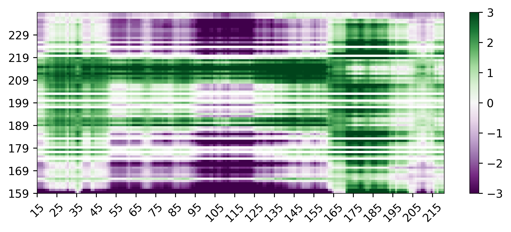

Predicting IDR:folded domain interactions
=============================================

For quantifying IDR:folded domain interactions, FINCHES contains code for structural decomposition of PDB files to excise out surface residues and then group those surface residues into local communities.

How are IDR:FD intermaps calculated?
--------------------------------------
As of the spring of 2025 we re-implemented how IDR:FD surfaces are calculated to generate intermaps. Specifically, what we now do is more analagous to the IDR:IDR intermaps and provides a much more visually interpretable representation of the interaction. Specifically we do the following.

1. We take a folded domain as a PDB file.
2. We segregate the residues into surface residues and internal residues based on their solvent accessible surface area
3. We then construct a graph that connects all the surface residues via the shortest space-space distance. This does not guarentee a perfect convex hull over the protein surface, but does a reasonable job of allowing communities of residues on the surface that are in the same "patch".
4. Having done this, we can then get the sequences that will be used for building the intermap. For the IDR, we use a sliding window and walk along the IDR sequence, converting an *n* residue IDR into an *n* - *window_size* + 1 set of fragments. For the folded domain, we take each residue and identify the community of residues that are close to that residue to define a patch. By default that patch distance threshold is 12 angstroms, but this can be adjusted using the `patch_radius` parameter in the ``calculate_idr_surface_patch_interactions()`` function. We then compute the epsilon interaction between the psuedo-sequence from the patch and the IDR fragment. This means every residue on the folded domain recieves a score for every IDR fragment. For residues that are not surface accesible, those scores are set to 0. In this way, we can plot an intermap that enables folded domain/IDR residues to be plotted on a matrix.

.. code-block:: python
    
    # note we needed the folded_domain_utils module because this lets us build a FoldedDomain, which is
    # where all the magic happens...
    from finches.utils import folded_domain_utils
    from finches import CALVADOS_frontend

    # import for plotting
    import matplotlib.pyplot as plt
    from matplotlib.pyplot import figure

    # initialize a CALVADOS frontend object
    cf = CALVADOS_frontend()

    # define the sequence of your IDR of interest
    gcn4_ntd         = 'MSEYQPSLFALNPMGFSPLDGSKSTNENVSASTSTAKPMVGQLIFDKFIKTEEDPIIKQDTPSNLDFDFALPQTATAPDAKTVLPIPELDDAVVESFFSSSTDSTPMFEYENLEDNSKEWTSLFDNDIPVTTDDVSLADKAIESTEEVSLVPSNLEVSTTSFLPTPVLEDAKLTQTRKVKKPNSVVKKSHHVGKDDESRLDHLGVVAYNRKQRSIPLSPIVPESSDPAALKRARNT'

    # initialize a FoldedDomain using a PDB file. This initialize will under the hood do a bunch
    # of things needed to map surface:IDR intermaps
    FD = folded_domain_utils.FoldeDomain('ADBD1.pdb')

    # set window size, we recommend 31 for consistencty with IDR:IDR intermaps but this value may need
    # to be smaller if you have a smaller IDR or folded domain.
    window_size = 31

    # we have this here just to ensure the window size is odd...
    if window_size % 2 != 1:
        raise Exception('window_size must be odd')

    # calculate surface:IDR intermap. This is where the magic happens...    
    X = FD.calculate_idr_surface_patch_interactions(gcn4_ntd, mf.IMC_object, window_size)

    ### PLOT FD:IDR intermap

    # define settings for visualization
    vmax=3
    vmin=-3
    cmap='PRGn'
    tic_frequency = 10

    # we have to calculate where the IDR sequence is going to start/end based on splitting the window into N/C terminal halbves
    half_window = int((window_size-1)/2)
    idr_start = half_window
    idr_end = len(gcn4_ntd) - half_window

    # we define the start and end induces for he folded domain 
    fd_start = 1
    fd_end = len(FD) 

    # this is the residue where the fd starts in its original protein
    fd_offset = 158

    figure(None, (7,3), dpi=350)

    # X[1] here is a (81, 206) matrix with surface:IDR interactions (FD =81 residues, IDR=236, and we loose 30 residues from the sliding window)    
    plt.imshow(X[1], extent=[idr_start, idr_end, fd_start, fd_end], origin='lower', aspect='auto', vmax=vmax, vmin=vmin, cmap=cmap)
    ax = plt.gca()

    # Set the axis tick values to be interpretable numbers
    ax.set_yticks(np.arange(fd_start, fd_end, tic_frequency), np.arange(fd_start+fd_offset, fd_end+fd_offset, tic_frequency))
    ax.set_xticks(np.arange(idr_start, idr_end, tic_frequency))
    ax.tick_params(axis='x', rotation=45)  # Rotates the x-tick labels by 45 degrees

    plt.colorbar()
    plt.tight_layout()

