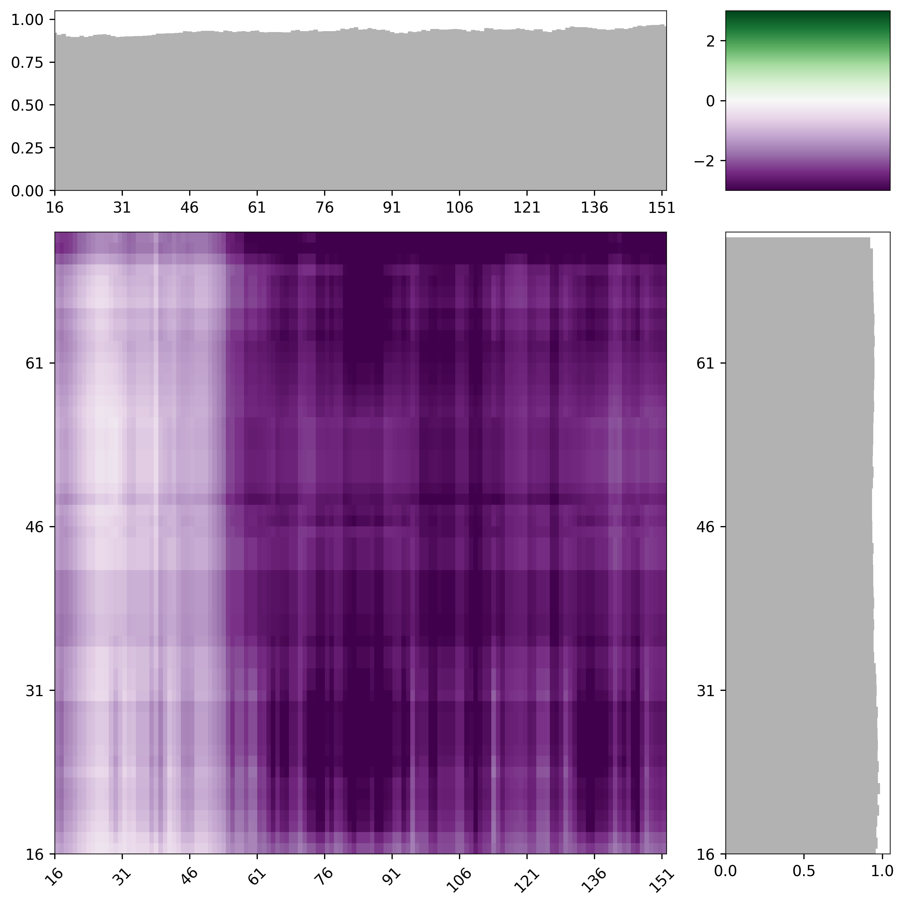
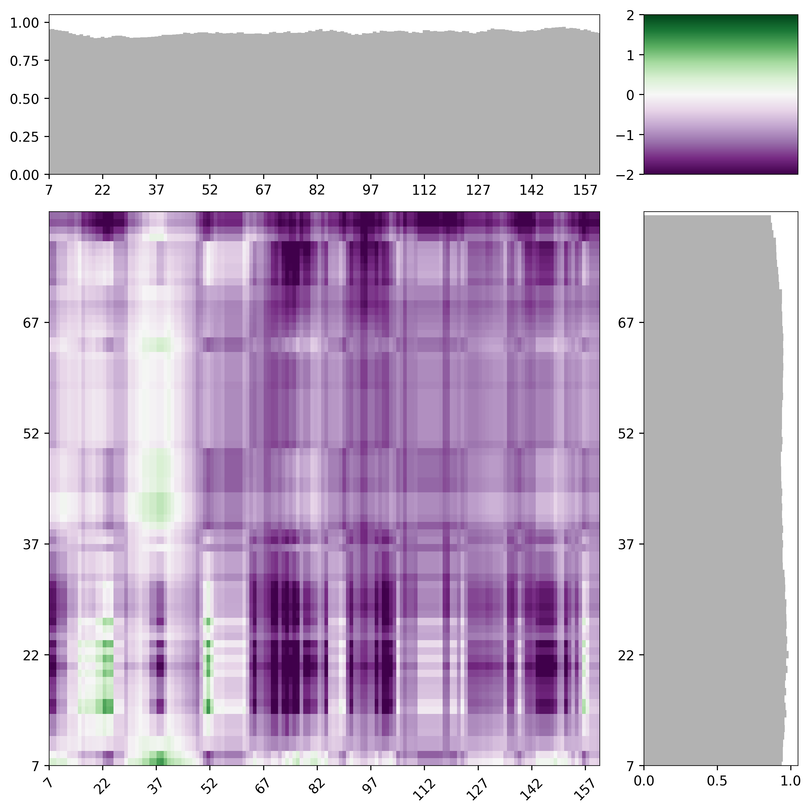

Predicting IDR:IDR interactions
====================================
For quantifying IDR:IDR interactions, FINCHES enables the rapid generation of intermaps.

What are intermaps?
---------------------

FINCHES lets you generated predicted intermolecular interaction maps (intermaps), which provide a 2D map of how two IDRs are likely to interact with one another. The x-axis is one sequence and the y-axis is the other. The color of each pixel in the intermap indicates the predicted interaction strength between the two residues at that position. We default to using purple (attractive) and green (repulsive) as our colorscheme of choice.

How do you calculate IDR:IDR intermaps?
--------------------------------------------

Intermaps can be calculated using the frontend objects

.. code-block:: python

    # import the Mpipi_frontend object
    from finches import Mpipi_frontend, CALVADOS_frontend

    # initialize the frontend objects (note can change salt)
    mf = Mpipi_frontend()
    cf = CALVADOS_frontend()

    # laf-1 RGG domain (1-168)
    s1 = 'MESNQSNNGGSGNAALNRGGRYVPPHLRGGDGGAAAAASAGGDDRRGGAGGGGYRRGGGNSGGGGGGGYDRGYNDNRDDRDNRGGSGGYGRDRNYEDRGYNGGGGGGGNRGYNNNRGGGGGGYNRQDRGDGGSSNFSRGGYNNRDEGSDNRGSGRSYNNDRRDNGGD'

    # laf-1 CTD (622-708)
    s2 = 'LEGMSGDMRSGGGYRGRGGRGNGQRFGGRDHRYQGGSGNGGGGNGGGGGFGGGGQRSGGGGGFQSGGGGGRQQQQQQRAQPQQDWWS'

    # calculate epsilon; note we set the tic_frequency to 15 because this is quite a short sequence
    mf.interaction_figure(s1,s2, tic_frequency=15)
    

The ``interaction_figure()`` function can take a number of additional arguments to customize the intermap. These are described in the Frontend Object API docs.

If you want the actual underlying matrix for further numerical manpulation this can be obtained using

.. code-block:: python

    # build intermolecular_idr_matrix
    (M, d1, d2) = mf.intermolecular_idr_matrix(s1,s2)

Note that here:

* ``M``: This is interaction matrix, and is itself a tuple of 3 elements. The first is the matrix of sliding epsilon values, and the second and 3rd are the indices that map sequence position from sequence1 and sequence2 to the matrix
* ``d1``: disorder profile for sequence 1. Will be all 1s if disorder_1 is False
* ``d2``: disorder profile for sequence 2. Will be all 1s if disorder_2 is False

Caveats and considerations
------------------------------
1. Intermaps clip their values at the min and max; we have chosen the min and max for Mpipi and CALVADOS-based FINCHES implementations to be specific values that capture the relevant ranges, however, occassionally there will be subregions that interact much more strongly/weakly than the default min/max. This can be misleading as it may look like two pairs of sub-regionss are equally strong, whereas one may actually be much stronger than the other. However, if subregions are approach the min/max it's fair to assume these are strongly attractive/repulsive and whethere being 2x the min/max is really meaningful is less clear.

2. By default, intermaps are calculated using a windowsize of 31 amino acids (15 and 15 on each side of a central residue). This value was chosen emprically in that ~30 residue IDRs are of a length where chemical specificity can be encoded, such that using this lengthscale allows for a sliding window with reasonable chemical complexity. However, for shorter sequences it's often more useful to reduce the windowsize down. We have generally found betwee 11 and 31 to offer useful window sizes. As an example, the intermap with a windowsize of 13 is shown; it should be clear that identify subregions in the two sequences now because a bit easier with a smaller window size. 

.. code-block:: python

    # generate an intermap with a smaller window size
    mf.interaction_figure(s1,s2, tic_frequency=15, window_size=13, vmin=-2, vmax=2)

